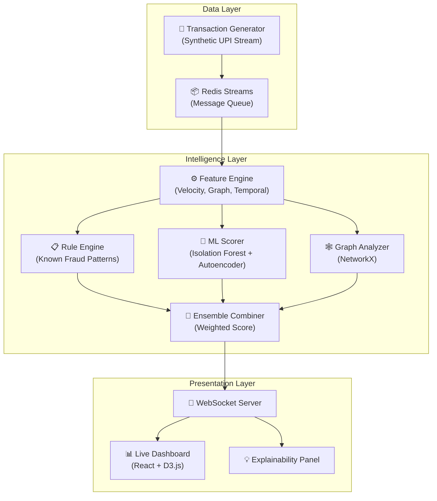
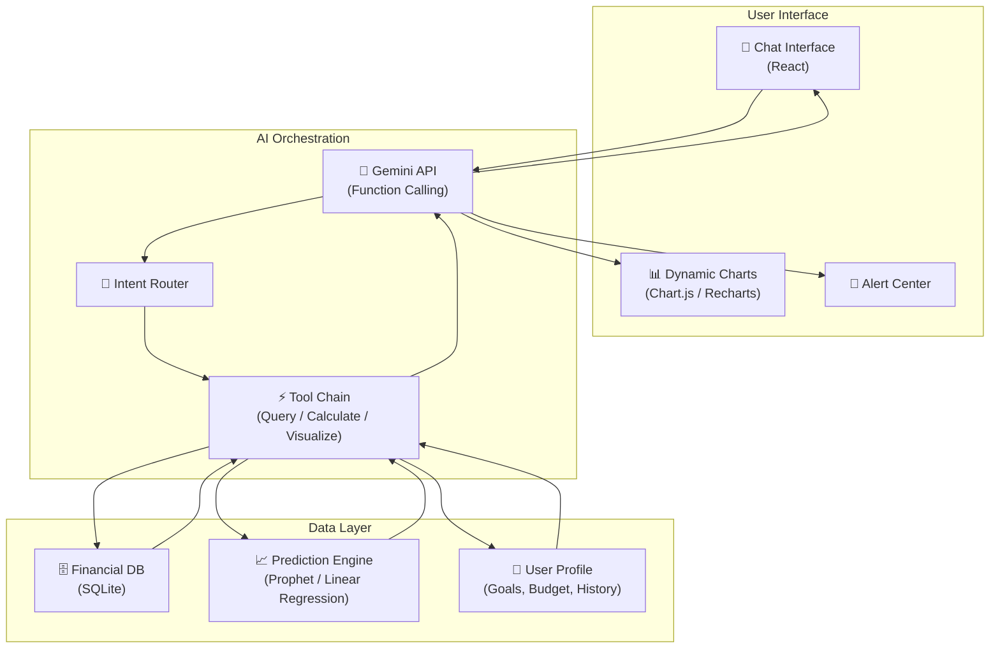
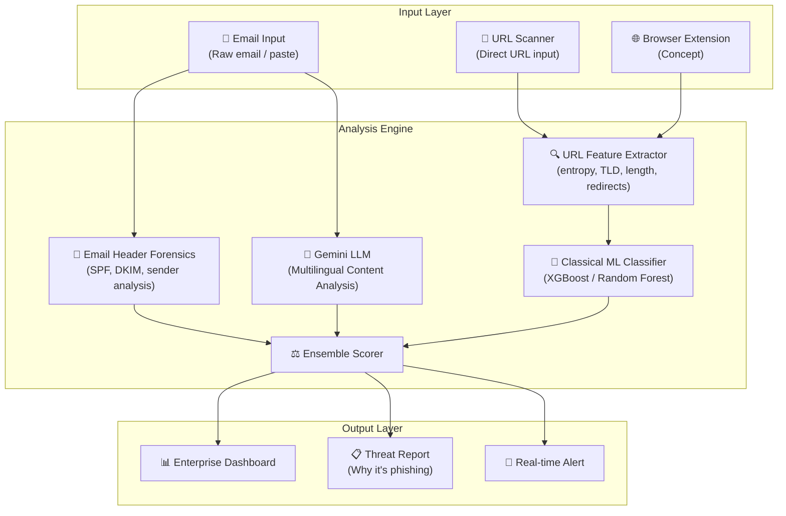

# 🏆 VNR Design-a-thon 2026 — Deep Strategic Analysis V2

---

## 1. Executive Summary

> [!IMPORTANT]
> **🥇 #1 Pick → PS 3.4: Real-Time Fraud Detection in UPI Transactions** (Score: **8.39**)
>
> The dominant choice. Combines fintech domain gravitas, streaming ML architecture, and the most impressive live demo possible (real-time transaction flow with fraud alerts). Cyber Security theme repels most teams, giving you a low-competition lane. Every judge uses UPI — instant emotional buy-in.

> **🥈 #2 Pick → PS 1.1: AI-Powered Personal Finance Intelligence System** (Score: **7.70**)
>
> "ChatGPT for your finances" is a pitch that sells itself. LLM agent with tool-use, NL-to-SQL, and auto-generated charts. Highly demo-able, highly resume-worthy. More competitive (Open Innovation attracts crowds), but a strong execution wins.

> **🥉 #3 Pick → PS 3.1: AI-Powered Phishing Detection for Indian Enterprises** (Score: **7.57**)
>
> The **multilingual Indian-language phishing** angle is a differentiation goldmine. Hybrid ML pipeline (classical URL features + LLM semantic analysis) is architecturally rich. Cyber Security theme keeps competition low.

---

## 2. Problem Statement Evaluation Table

### Metric Definitions & Weights

| # | Metric | Weight | What It Measures |
|---|--------|--------|-----------------|
| 1 | Uniqueness Difficulty | 12% | How unlikely other teams are to choose/solve it |
| 2 | Competition Density | 12% | How many teams will pick the same PS (higher = fewer competitors) |
| 3 | Technical Depth | 15% | System architecture & engineering complexity |
| 4 | AI/Innovation Potential | 5% | Opportunity for AI/automation/advanced algorithms |
| 5 | 24-Hour Feasibility | 5% | Realistically buildable MVP in 24 hours |
| 6 | Resume Value | 10% | How impressive it looks to recruiters |
| 7 | Demo Power | 8% | Potential for an exciting live demo |
| 8 | Problem Impact | 8% | Real-world importance & societal/business relevance |
| 9 | Solution Novelty Potential | 6% | Ability to design a non-obvious solution |
| 10 | Judge Appeal | 5% | Likelihood judges find it impressive |
| 11 | Architectural Impressiveness | 8% | Opportunity to showcase system design |
| 12 | Scope Control | 2% | Ability to build focused MVP without over-scoping |
| 13 | Data Availability | 5% | Availability of datasets/APIs needed |
| 14 | Presentation Potential | 3% | How easy to explain problem + solution in a pitch |
| 15 | Extension Potential | 1% | Ability to grow into startup/research |

### Raw Scores (1–10)

| PS | Title | Uniq | Comp | Tech | AI | Feas | Resm | Demo | Impt | Novl | Judg | Arch | Scop | Data | Pres | Ext | **Weighted** |
|----|-------|------|------|------|-----|------|------|------|------|------|------|------|------|------|------|-----|-------------|
| 1.1 | Personal Finance AI | 6 | 5 | 8 | 9 | 7 | 9 | 9 | 8 | 7 | 8 | 8 | 7 | 8 | 9 | 8 | **7.70** |
| 1.2 | Remote Sensing Insights | 7 | 7 | 8 | 8 | 3 | 7 | 5 | 7 | 6 | 6 | 7 | 4 | 4 | 5 | 6 | **6.22** |
| 1.3 | Carbon Footprint Tracker | 4 | 4 | 5 | 5 | 8 | 5 | 5 | 6 | 4 | 5 | 5 | 8 | 6 | 7 | 6 | **5.23** |
| 1.4 | Disaster Response Platform | 6 | 6 | 8 | 7 | 5 | 8 | 8 | 9 | 7 | 8 | 8 | 5 | 5 | 8 | 7 | **7.12** |
| 1.5 | Urban Traffic Optimization | 5 | 5 | 7 | 7 | 5 | 7 | 7 | 7 | 5 | 6 | 7 | 5 | 5 | 7 | 6 | **6.14** |
| 2.1 | Bias Detection in Hiring | 4 | 3 | 6 | 8 | 7 | 6 | 6 | 7 | 5 | 6 | 5 | 7 | 7 | 7 | 6 | **5.74** |
| 2.2 | Gender-Neutral Skill Engine | 3 | 3 | 5 | 5 | 8 | 5 | 4 | 6 | 4 | 5 | 4 | 8 | 7 | 6 | 5 | **4.82** |
| 2.3 | Digital Literacy Platform | 3 | 3 | 4 | 4 | 8 | 4 | 4 | 7 | 3 | 5 | 3 | 8 | 6 | 7 | 5 | **4.34** |
| 2.4 | Harassment Reporting System | 6 | 7 | 7 | 7 | 7 | 7 | 6 | 8 | 6 | 7 | 6 | 7 | 7 | 7 | 6 | **6.75** |
| 2.5 | Career Re-Entry Platform | 4 | 4 | 5 | 6 | 7 | 5 | 5 | 7 | 4 | 6 | 5 | 7 | 6 | 7 | 6 | **5.24** |
| 3.1 | Phishing Detection India | 7 | 8 | 8 | 8 | 6 | 8 | 8 | 8 | 8 | 7 | 8 | 6 | 7 | 7 | 7 | **7.57** |
| 3.2 | Deepfake Detection | 6 | 7 | 9 | 9 | 3 | 9 | 7 | 8 | 7 | 7 | 9 | 3 | 4 | 6 | 8 | **6.89** |
| 3.3 | IoT Security Smart Campus | 8 | 8 | 7 | 6 | 4 | 6 | 5 | 6 | 6 | 5 | 7 | 4 | 4 | 5 | 5 | **6.10** |
| 3.4 | **UPI Fraud Detection** | **8** | **9** | **9** | **9** | **7** | **9** | **9** | **9** | **8** | **8** | **9** | **7** | **7** | **9** | **9** | **8.39** |
| 3.5 | Cyber Threat Intelligence | 7 | 7 | 7 | 7 | 5 | 7 | 6 | 7 | 6 | 6 | 7 | 5 | 5 | 5 | 7 | **6.43** |

---

## 3. Ranked List (Best → Worst)

| Rank | PS | Title | Score | Theme |
|------|----|-------|-------|-------|
| 🥇 1 | **3.4** | Real-Time Fraud Detection in UPI Transactions | **8.39** | Cyber Security |
| 🥈 2 | **1.1** | AI-Powered Personal Finance Intelligence System | **7.70** | Open Innovation |
| 🥉 3 | **3.1** | AI-Powered Phishing Detection for Indian Enterprises | **7.57** | Cyber Security |
| 4 | **1.4** | Smart Disaster Response Coordination Platform | **7.12** | Open Innovation |
| 5 | **3.2** | Deepfake Detection for Digital Identity Verification | **6.89** | Cyber Security |
| 6 | **2.4** | AI-Powered Harassment Reporting & Escalation System | **6.75** | Gender & Inclusion |
| 7 | **3.5** | Cyber Threat Intelligence Aggregation Platform | **6.43** | Cyber Security |
| 8 | **1.2** | AI-Based System for Remote Sensing Data Insights | **6.22** | Open Innovation |
| 9 | **1.5** | AI-Powered Urban Traffic Flow Optimization | **6.14** | Open Innovation |
| 10 | **3.3** | IoT Security Risk Monitoring for Smart Campuses | **6.10** | Cyber Security |
| 11 | **2.1** | AI-Based Bias Detection in Hiring Systems | **5.74** | Gender & Inclusion |
| 12 | **2.5** | Career Re-Entry Platform for Women Professionals | **5.24** | Gender & Inclusion |
| 13 | **1.3** | Carbon Footprint Tracker for MSMEs | **5.23** | Open Innovation |
| 14 | **2.2** | Gender-Neutral Skill Assessment Engine | **4.82** | Gender & Inclusion |
| 15 | **2.3** | Digital Literacy Platform for Rural Women | **4.34** | Gender & Inclusion |

---

## 4. Top 3 — Full Strategic Deep Dive

---

### 🥇 #1 — PS 3.4: Real-Time Fraud Detection in UPI Transactions

#### A. Winning Solution Idea
**"FraudShield UPI"** — A real-time, AI-powered transaction monitoring engine that ingests UPI-like transaction streams, scores each transaction for fraud risk using an ensemble of graph-based, statistical, and ML models, and surfaces flagged transactions on a live command-center dashboard with full explainability.

#### B. High-Level System Architecture



**Key Architecture Decisions:**
- **Redis Streams** over Kafka — lighter, zero-config, perfect for hackathon
- **Ensemble scoring** (rule + statistical + ML) — shows engineering maturity
- **WebSocket push** — real-time dashboard without polling
- **NetworkX graph** — transaction network analysis for ring-fraud detection

#### C. Key Differentiating Features (vs. Other Teams on Same PS)

| Differentiator | What You Build | What Others Likely Build |
|----------------|---------------|------------------------|
| **Graph-based fraud rings** | NetworkX transaction graphs detecting coordinated fraud | Simple threshold-based rules |
| **Ensemble ML scoring** | 3-model ensemble (Isolation Forest + Autoencoder + Rules) | Single model or only rules |
| **Explainable AI** | "Why flagged?" panel with feature attribution | Black-box flag/no-flag |
| **Temporal velocity features** | Txn frequency, amount acceleration, time-of-day patterns | Just amount thresholds |
| **Live streaming architecture** | Redis Streams + WebSocket real-time pipeline | Batch processing or REST polling |
| **Behavioral biometrics** | User spending profile deviation scoring | No user modeling |
| **Network topology** | Visualize suspicious sender-receiver clusters | No graph visualization |

> [!TIP]
> **The #1 differentiator is the graph-based fraud ring detection.** Most teams will build threshold rules. You build a system that detects *coordinated multi-account fraud* — that's what real payment companies (Razorpay, Stripe) do.

#### D. 24-Hour Implementation Plan

| Hour | Phase | Deliverable |
|------|-------|-------------|
| 0–1 | **Setup** | Project scaffold (React + Python FastAPI), Redis setup, folder structure |
| 1–3 | **Data Layer** | Transaction generator (synthetic UPI data with injected fraud patterns), Redis stream producer/consumer |
| 3–6 | **Feature Engineering** | Velocity features, temporal features, amount statistics, graph features (NetworkX) |
| 6–9 | **ML Pipeline** | Isolation Forest training on synthetic data, Autoencoder for anomaly scoring, rule engine for known patterns |
| 9–11 | **Ensemble + API** | Weighted ensemble combiner, FastAPI endpoints for scoring + explainability |
| 11–14 | **Dashboard** | React dashboard: live txn stream, fraud alerts, risk gauge, graph visualization (D3.js/vis.js) |
| 14–16 | **Explainability** | "Why flagged?" panel showing top contributing features per flagged txn |
| 16–18 | **Integration** | WebSocket real-time push, end-to-end flow testing, bug fixes |
| 18–20 | **Polish** | UI animations, color coding, alert sounds, dark theme, responsive layout |
| 20–22 | **Demo Prep** | Craft demo script, prepare fraud injection scenarios, test edge cases |
| 22–24 | **Final** | Architecture diagram slide, pitch deck, dry-run demo 3× |

#### E. Demo Strategy

> **The demo should feel like walking into a fintech company's fraud operations center.**

```
🎬 DEMO SCRIPT (5 minutes)
───────────────────────────

[0:00–0:30] HOOK
→ "India processes 400M+ UPI transactions daily.
   For every 1 second we speak, 4,600 transactions happen.
   Our system watches all of them."
→ Open the live dashboard — hundreds of green transactions flowing.

[0:30–1:30] NORMAL STATE
→ Show transactions streaming in real-time (green dots flowing).
→ Point out the velocity panel, amount distribution, user profiles.
→ "Everything is normal. Now watch what happens..."

[1:30–3:00] FRAUD INJECTION
→ Trigger Scenario 1: Rapid micro-transactions (₹1-₹5) to 20 new accounts
   → System flags with RED ALERT. Confidence: 94%.
   → Click "Why?" → Explainability: "Unusual velocity spike: 20 txns
     in 30s vs. average 2/hr. All recipients are first-time contacts."
→ Trigger Scenario 2: Large amount to a dormant account at 3 AM
   → Flagged. "Amount 15× above user average. Recipient inactive 90 days.
     Time-of-day anomaly."

[3:00–4:00] GRAPH VIEW
→ Switch to network graph view.
→ Show a fraud ring: 5 accounts sending money in a circle
   (A→B→C→D→E→A) — classic mule network.
→ "Our graph engine detected a coordinated laundering ring
   that no threshold rule would catch."

[4:00–5:00] ARCHITECTURE + CLOSE
→ Flash the system architecture diagram.
→ "Redis Streams → Feature Engine → 3-Model Ensemble → WebSocket Push.
   Sub-second scoring. Horizontally scalable."
→ "This isn't a prototype. This is how real payment companies
   think about fraud."
```

#### F. Future Expansion

| Path | Description |
|------|-------------|
| **Startup** | White-label fraud detection API for small UPI payment apps/fintechs. India has 50+ UPI apps — most lack sophisticated fraud detection. |
| **Research** | Graph neural networks for fraud ring detection. Federated learning across banks without sharing transaction data. |
| **Open Source** | "OpenFraudGuard" — open-source UPI fraud detection framework with pluggable models, rules, and dashboards. |

---

### 🥈 #2 — PS 1.1: AI-Powered Personal Finance Intelligence System

#### A. Winning Solution Idea
**"FinSage"** — A conversational AI financial advisor that understands natural language, queries your structured financial data via function calling, generates visual insights (charts, forecasts), and proactively alerts you about spending anomalies and goal deviations.

#### B. High-Level System Architecture



**Key Architecture Decisions:**
- **Gemini Function Calling** — not a wrapper; the LLM executes structured tool calls
- **NL-to-SQL** via function definitions — structured, auditable queries
- **Prophet** for spending forecasts — lightweight, no GPU
- **Proactive alerts** — anomaly detection on spending patterns

#### C. Key Differentiating Features (vs. Other Teams on Same PS)

| Differentiator | What You Build | What Others Likely Build |
|----------------|---------------|------------------------|
| **True function calling** | LLM invokes typed tools (query_spending, forecast, set_goal) | Raw prompt → text response |
| **Auto-generated charts** | LLM decides chart type + generates data payload → rendered in React | Text-only responses |
| **Predictive modeling** | Prophet-based spending forecast with confidence intervals | No forecasting |
| **Proactive alerts** | Background anomaly detector flags unusual spending | Only reactive chat |
| **Multi-turn memory** | Conversation context tracks follow-up questions | Stateless Q&A |
| **India-specific** | UPI categories, festival spending patterns, tax-saving suggestions | Generic finance |

#### D. 24-Hour Implementation Plan

| Hour | Phase | Deliverable |
|------|-------|-------------|
| 0–1 | **Setup** | Vite + React, FastAPI backend, SQLite, Gemini API key |
| 1–3 | **Data Layer** | Synthetic financial dataset (12 months of txns, 15 categories, credit score, goals), SQLite schema + seed |
| 3–6 | **AI Core** | Gemini function calling with 8 tools: `query_spending`, `compare_months`, `forecast`, `set_goal`, `check_goal`, `category_breakdown`, `anomaly_check`, `advice` |
| 6–9 | **NL-to-Query** | Intent routing, SQL generation, result formatting back to natural language |
| 9–12 | **Visualization** | Chart.js integration: auto-generate pie/bar/line charts based on query type |
| 12–14 | **Prediction** | Prophet spending forecast, goal-tracking projections |
| 14–16 | **Alerts** | Spending anomaly detector, budget threshold alerts, goal deviation warnings |
| 16–19 | **UI Polish** | Chat UI with message bubbles, inline charts, dark mode, smooth animations |
| 19–21 | **Integration** | End-to-end testing, edge case handling, error states |
| 21–23 | **Demo Prep** | Script demo conversation, prepare impressive queries |
| 23–24 | **Final** | Architecture slide, pitch rehearsal |

#### E. Demo Strategy

```
🎬 DEMO SCRIPT (5 minutes)
───────────────────────────

[0:00–0:30] HOOK
→ "What if you could talk to your money?"
→ Open FinSage — clean dark-mode chat UI.

[0:30–1:30] BASIC POWER
→ Type: "How much did I spend on food this month?"
→ System: Queries DB → returns ₹12,450 with a pie chart breakdown
   (Swiggy 40%, Dining 35%, Groceries 25%).
→ Type: "Compare it with last month"
→ System: Side-by-side bar chart. "You spent 23% more this month."

[1:30–2:30] INTELLIGENCE
→ Type: "Am I on track for my Goa trip savings?"
→ System: Goal tracker with forecast line.
   "At current rate, you'll be ₹4,200 short. Reduce dining
   by ₹2,000/month to stay on track."
→ This shows PREDICTION + GOAL TRACKING + ACTIONABLE ADVICE.

[2:30–3:30] PROACTIVE AI
→ Show the Alert Center: "⚠️ Unusual spike: ₹8,000 on Shopping
   yesterday — 3× your daily average."
→ Type: "Why did my credit score drop?"
→ System: "Credit utilization increased to 68% this month.
   Recommendation: Pay ₹15,000 before cycle date."

[3:30–4:30] ARCHITECTURE
→ Show function calling flow: User → Gemini → Tool Call → DB → Chart
→ "The AI doesn't guess. It executes structured queries
   and shows you auditable results."

[4:30–5:00] CLOSE
→ "FinSage isn't a chatbot. It's a financial reasoning engine."
```

#### F. Future Expansion

| Path | Description |
|------|-------------|
| **Startup** | Connect real bank APIs (Account Aggregator framework in India). Monetize via premium insights + financial product recommendations. |
| **Research** | Financial LLM fine-tuning on Indian spending patterns. Multi-modal: scan receipts → auto-categorize. |
| **Open Source** | "OpenFinAgent" — open-source framework for building financial AI agents with pluggable data sources and tool chains. |

---

### 🥉 #3 — PS 3.1: AI-Powered Phishing Detection for Indian Enterprises

#### A. Winning Solution Idea
**"PhishGuard India"** — A hybrid AI phishing detection system that combines classical ML URL analysis with LLM-powered multilingual email content analysis, specifically built for Indian enterprises dealing with phishing in Hindi, Telugu, Tamil, and other regional languages.

#### B. High-Level System Architecture



#### C. Key Differentiating Features (vs. Other Teams on Same PS)

| Differentiator | What You Build | What Others Likely Build |
|----------------|---------------|------------------------|
| **Multilingual detection** | Hindi, Telugu, Tamil phishing analyzed via Gemini | English-only |
| **Hybrid pipeline** | Classical ML (URL features) + LLM (content semantics) | Only one approach |
| **Email header forensics** | SPF/DKIM validation, sender reputation | Content-only analysis |
| **Explainable verdicts** | "Why phishing?" with feature-by-feature breakdown | Binary yes/no |
| **India-specific patterns** | KYC scam templates, UPI phishing, Aadhaar fraud patterns | Generic phishing |
| **Enterprise dashboard** | Org-wide phishing analytics, trend charts, department heatmap | Single-email checker |
| **URL feature engineering** | 15+ features: entropy, homoglyph detection, subdomain depth | Simple blocklist check |

#### D. 24-Hour Implementation Plan

| Hour | Phase | Deliverable |
|------|-------|-------------|
| 0–1 | **Setup** | React + FastAPI scaffold, API keys, dataset download (PhishTank + custom Hindi samples) |
| 1–4 | **URL Engine** | Feature extractor (15 features: entropy, length, TLD risk, subdomain depth, homoglyphs, IP-based, HTTPS, redirects), XGBoost classifier trained on PhishTank |
| 4–7 | **Content Engine** | Gemini-based email analysis prompt for multilingual phishing detection with structured output (risk score, reasons, language detected) |
| 7–9 | **Header Engine** | SPF/DKIM check simulation, sender domain age, reply-to mismatch detection |
| 9–11 | **Ensemble** | Weighted combination of URL score + content score + header score → final verdict with confidence |
| 11–14 | **Dashboard** | Enterprise dashboard: recent scans, threat level gauge, department breakdown, trend timeline |
| 14–16 | **Explainability** | "Why flagged?" report for each detection with per-feature breakdown |
| 16–18 | **Multilingual Demo** | Curate 5 Hindi, 3 Telugu, 2 Tamil phishing email samples for demo |
| 18–20 | **UI Polish** | Dark theme, animations, risk color coding (green/yellow/red), scan progress animation |
| 20–22 | **Integration** | End-to-end testing, edge cases, performance |
| 22–24 | **Demo Prep** | Script, architecture slide, dry runs |

#### E. Demo Strategy

```
🎬 DEMO SCRIPT (5 minutes)
───────────────────────────

[0:00–0:30] HOOK
→ "83% of Indian enterprises faced phishing attacks last year.
   But here's the problem — most phishing tools only detect
   English attacks. Indian attackers now send phishing
   in Hindi, Telugu, and Tamil."

[0:30–1:30] ENGLISH PHISHING
→ Paste a classic English phishing email (fake bank alert).
→ System scans → RED alert: "Phishing detected. Confidence: 96%"
→ Show breakdown: "Sender domain age: 2 days. SPF: fail.
   URL entropy: 4.2 (suspicious). Content: urgency language detected."

[1:30–3:00] HINDI PHISHING (THE DIFFERENTIATOR)
→ Paste a Hindi phishing email: "आपका UPI खाता बंद हो रहा है..."
→ System detects language: Hindi.
→ RED alert: "Phishing detected. Confidence: 91%"
→ Breakdown: "Language: Hindi. Pattern: UPI account suspension scam.
   URL: homoglyphic domain (ρayρal.com using Greek ρ).
   Urgency markers: 'तुरंत' (immediately), 'खाता बंद' (account closed)."
→ "No other tool in this hackathon does this."

[3:00–4:00] URL SCANNER
→ Enter a suspicious URL → real-time feature extraction visualization
→ Show entropy calculation, TLD risk, redirect chain analysis
→ Verdict with feature importance chart

[4:00–5:00] ENTERPRISE DASHBOARD + CLOSE
→ Show org-wide analytics: "Your company received 47 phishing
   attempts this week. 23% were in regional languages."
→ Department heatmap showing most-targeted teams.
→ Architecture diagram: "Hybrid pipeline = ML + LLM + forensics."
→ "PhishGuard India protects enterprises in the languages
   attackers actually use."
```

#### F. Future Expansion

| Path | Description |
|------|-------------|
| **Startup** | Enterprise SaaS phishing protection for Indian companies. Integrate with email gateways (Google Workspace, Office 365). |
| **Research** | Multilingual adversarial phishing generation + detection. Study code-switching patterns in Indian phishing campaigns. |
| **Open Source** | "PhishGuard" — open-source multilingual phishing detection toolkit with Indian language models and URL feature extractors. |

---

## 5. Final Decision Matrix

| Criteria | 🥇 PS 3.4 (UPI Fraud) | 🥈 PS 1.1 (Finance AI) | 🥉 PS 3.1 (Phishing) |
|----------|----------------------|----------------------|---------------------|
| **Win Probability** | ⭐⭐⭐⭐⭐ | ⭐⭐⭐⭐ | ⭐⭐⭐⭐ |
| **Competition** | Very Low | Medium-High | Low |
| **Demo Impact** | 🔥🔥🔥🔥🔥 | 🔥🔥🔥🔥 | 🔥🔥🔥🔥 |
| **Resume Strength** | Fintech + ML + Streaming | AI Agents + NLP | Security + NLP |
| **Risk Level** | Low (synthetic data) | Low (mock data + API) | Low (public datasets) |
| **Judge Relatability** | Every judge uses UPI | Every judge has finances | Every judge gets spam |

> [!CAUTION]
> **Competition Risk Warning:**
> - **PS 1.1 (Finance AI)** will attract the most teams in Open Innovation — you *must* differentiate with function calling + charts + forecasting, not just a chatbot.
> - **PS 3.4 and 3.1** (Cyber Security) will have the fewest competitors — your odds are structurally better regardless of execution quality.

```
┌─────────────────────────────────────────────────────────────┐
│                                                             │
│   FINAL RECOMMENDATION                                     │
│                                                             │
│   🥇 GO WITH → PS 3.4: UPI Fraud Detection                 │
│       Highest score. Lowest competition. Best demo.         │
│       Every judge uses UPI. Fintech resume gold.            │
│                                                             │
│   🥈 BACKUP  → PS 1.1: Personal Finance AI                 │
│       If you want the LLM agent angle for your resume.      │
│                                                             │
│   🥉 SAFE    → PS 3.1: Phishing Detection                  │
│       If you want a lower-risk, still-impressive pick.      │
│                                                             │
└─────────────────────────────────────────────────────────────┘
```
